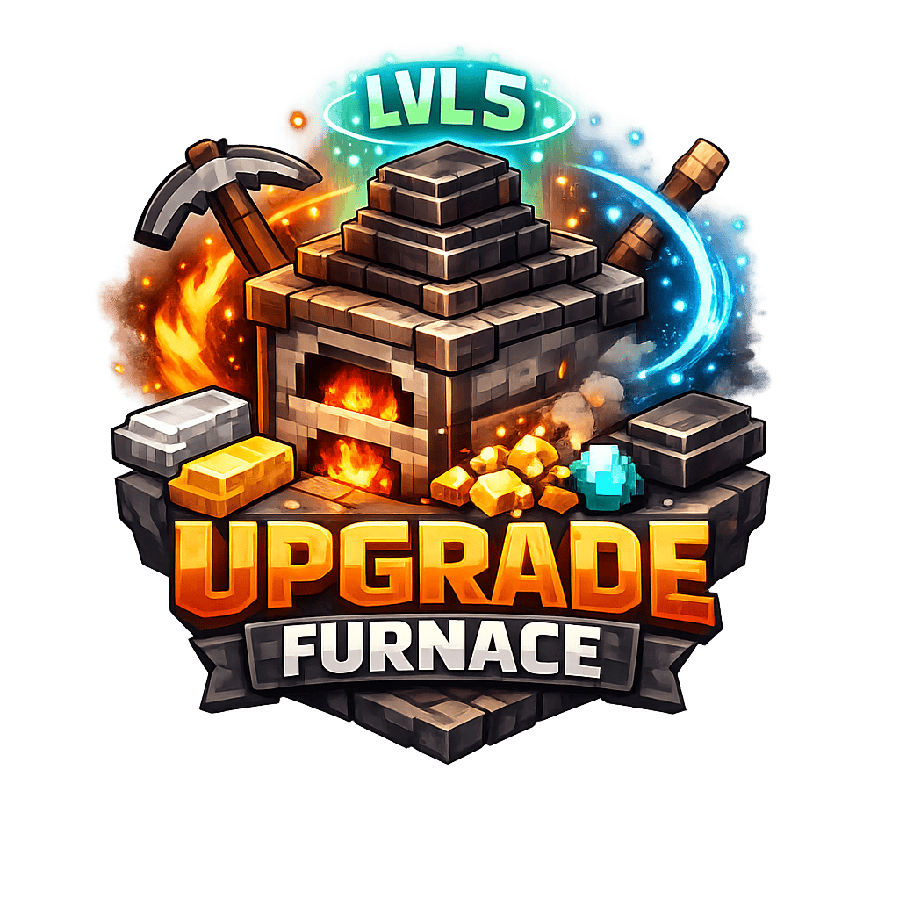

<p align="center">
  
</p>

# UpgradeFurnace

_**A PaperMC 1.21 - 1.21.11 plugin to upgrade furnaces for faster smelting and bonus yields.**_

## Features

- **5 Tiered Furnace Upgrades**: Upgrade a furnace from level 1 to 5 using configurable materials.
- **Configurable Smelting Speed**: Each level has its own speed multiplier.
- **Bonus Yield**: At higher levels, smelting yields bonus output.
- **Holographic Display**: Shows the current upgrade level above each furnace.
- **Spiral Particle Animation**: Continuous ascending spiral particles around upgraded furnaces.
- **Configurable Particles**: Define custom particles for each level in `config.yml`.
- **Configurable Requirements**: Define materials, amounts, XP levels, speed, and particles per level.
- **Brigadier Command**: `/upgrade furnace` to perform upgrades.

## Requirements

- Java 21+
- PaperMC 1.21 - 1.21.11

## Installation

1. Download the latest `UpgradeFurnace.jar` from the [SpigotMC](https://www.spigotmc.org/resources/upgrade-furnace.124315/) page.
2. Place the JAR into your server's `plugins` folder.
3. Start the server to generate default config and permissions files.

## Configuration (`config.yml`)

```yaml
basic:
  server-name: "MyServer"
  customhelp: true

requirements:
  1:
    material: IRON_INGOT
    amount: 32
    xp_levels: 0
    speed_multiplier: 2      # Divides cook time (higher = faster)
    particle: SMOKE          # Particle effect for this level
  2:
    material: GOLD_INGOT
    amount: 32
    xp_levels: 0
    speed_multiplier: 3
    particle: FLAME
  3:
    material: DIAMOND
    amount: 32
    xp_levels: 0
    speed_multiplier: 4
    particle: CLOUD
  4:
    material: NETHERITE_INGOT
    amount: 20
    xp_levels: 0
    speed_multiplier: 5
    particle: SOUL_FIRE_FLAME
  5:
    material: NETHERITE_INGOT
    amount: 30
    xp_levels: 100
    speed_multiplier: 6
    particle: TOTEM_OF_UNDYING
```

### Configuration Options

| Option | Description |
|--------|-------------|
| `basic.server-name` | Prefix for plugin messages |
| `requirements.<level>.material` | Material needed for that upgrade level |
| `requirements.<level>.amount` | Amount of material required |
| `requirements.<level>.xp_levels` | XP levels required for upgrade |
| `requirements.<level>.speed_multiplier` | Cook time divisor (higher = faster) |
| `requirements.<level>.particle` | Particle effect for spiral animation |

## Commands

| Command | Permission | Description |
|---------|------------|-------------|
| `/upgrade furnace` | `upgradefurnace.upgrade.furnace` | Upgrade the furnace you're looking at |

**Usage**: Look at a furnace and run `/upgrade furnace`. The plugin checks your inventory for the required materials and performs the upgrade if possible.

## Permissions

| Permission | Default | Description |
|------------|---------|-------------|
| `upgradefurnace.upgrade.furnace` | `true` | Allows use of `/upgrade furnace` |

## Events & Effects

- **FurnaceStartSmeltEvent**: Reduces cook time based on `speed_multiplier`.
- **FurnaceSmeltEvent**: Applies bonus yield at higher levels.
- **Spiral Particles**: Continuous ascending spiral animation around upgraded furnaces.
- **Upgrade Particles**: Burst effect when upgrading a furnace.

## Development & Contribution

1. Fork the repository.
2. Clone your fork and create a feature branch.
3. Implement changes and update the README if needed.
4. Submit a pull request describing your changes.

## License

This plugin is released under the GPL License. See [LICENSE](LICENSE) for details.

---
*Made with ❤️ by LowdFX*
